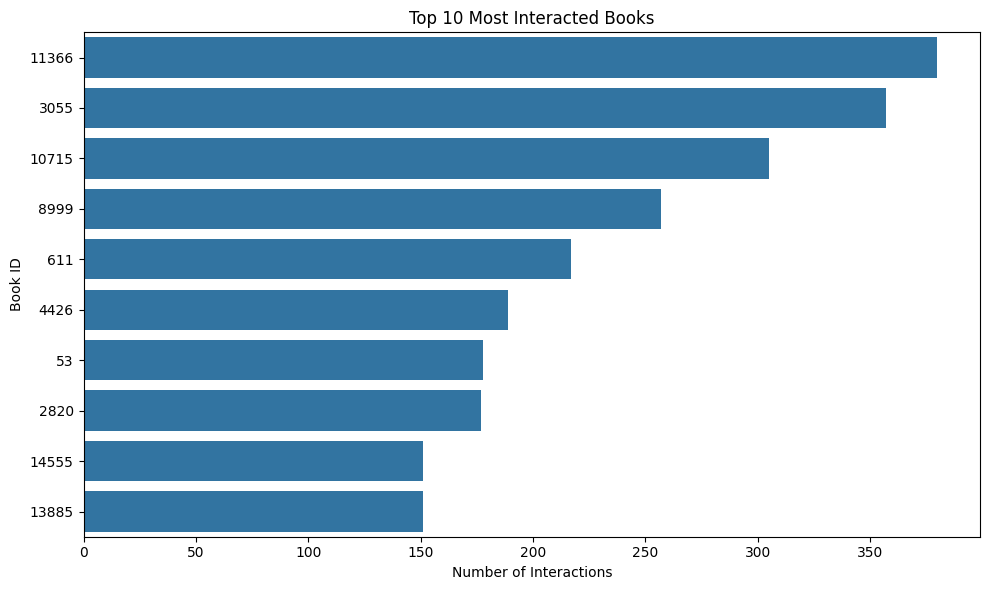
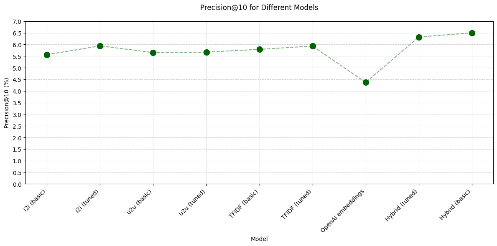
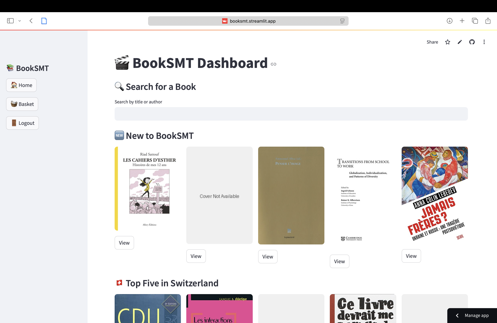

# Building a Book Recommendation System for Library Users


## 🧠 Overview

Ever wandered through a library, overwhelmed by the sheer number of books, wondering what to read next? Now imagine the library knows you so well, it can whisper, *“You might also like…”* just like your favorite streaming platform. That's exactly what this project aims to do.

We tried to build a smart recommendation system for the university’s library platform to help students and staff discover books they’ll actually want to read, based on what books they’ve interacted with before, what others like them are reading, and even the hidden magic tucked inside book metadata.

Our system predicts which books each user is most likely to enjoy and presents the **Top 10 personalized recommendations**. We used a mix of techniques like collaborative filtering and text embeddings to make these suggestions as accurate and interesting as possible.

💡 **Goal**: We evaluated our models using **Precision@10**, with the goal of achieving a leaderboard score higher than 0.1452.

---
### 🔎 Navigate through the process with us:

- [📊 Exploratory Data Analysis (EDA)](#-exploratory-data-analysis-eda) 
- [🛠️ Models and Methods](#️-models-and-methods)
- [🧪 Evaluation Results](#-evaluation-results)
- [🌟 Best Model & Interpretation](#-best-model--interpretation)
- [🧪 Data Augmentation](#-data-augmentation)
- [🎯 Final Leaderboard Score](#-final-leaderboard-score)
- [💡 Interface (Streamlit App)](#-interface-streamlit-app)
- [📹 Video Presentation](#-video-presentation)
- [📌 Key Takeaways](#-key-takeaways)

---
## 📊 Exploratory Data Analysis (EDA)
### Acquiring our data
For this assignment, two datasets were provided. The first one, _items_, contains information about the books, such as the book id (helps us link the correct item to the one a user interacted with), title, author, ISBN, publisher, and some subjects. The books are in French. The second dataset, _interactions_, contains the known interactions between the users and the items, as well as a timestamp (when the interaction occurred). This _interactions_ dataset is the training part of a larger dataset; the test part is what our recommendations are compared to on the leaderboard.

Based on a first look of our datasets, we have:
- Total users = 7,838
- Total books (including books no one has interacted with) = 15,291
- Number of interactions = 87,047
- Items no user has interacted with = 182
  
### Checking for duplicates
It is possible that a user has interacted with the same item multiple times. However, given that there is a timestamp for each user's interaction with an item, we can see if there are any duplicates since only one interaction should be registered for one instance of an interaction. There should also not be any duplicates in the _items_ dataset.

To test this, we run the following:
```python
# Checking duplicates in the interactions and items datasets
interaction_duplicates = interactions.duplicated().sum()
items_duplicates = items.duplicated().sum()
print(f'Interaction data duplicates = {interaction_duplicates}, Item data duplicates = {items_duplicates}')
```
The results show that we have two (2) duplicates in _interactions_; no duplicates in _items_. We handled these duplicates by dropping the second appearance of the interaction (same user, item, and timestamp).

### Checking missing values
To understand the coverage of our data, we decided to check how many missing values we have in each column of the two datasets. The results showed that the _interactions_ dataframe is complete and has no missing values. The _items_ dataframe, however, has quite a few missing values:

| Feature       | Missing Values |
|---------------|----------------|
| Title         | 0              |
| Author        | 2,653          |
| ISBN Valid    | 723            |
| Publisher     | 25             |
| Subjects      | 2,223          |
| i             | 0              |

This limited amount of data could limit our possibilities to create a more precise recommender system. One way to address this issue is to use API calls to retrieve more metadata. Therefore, we used Google Books and ISBNdb API calls to try to fill some missing values, as well as adding more information about the items. These API calls added valuable information such as:

  - filling in missing Authors
  - adding book cover images
  - adding description/summaries
  - adding book dimensions
  - adding publication date

...and so on. This additional data was used to later improve our embedding quality and, as a result, recommendation relevance. Although we are getting ahead of ourselves with this, in order to make it easier to follow along in the process, we decided to put the code for this metadata aquisition and cleaning in a separate file. The code for this can be found [here](./code/API_calls-ipynb). Adding the information from the API calls reduced, for example, the number of missing authors from 2,653 to only 789.

### Visualizing the data

#### Books with the most interactions



The graph above shows that there are some books that seem to be a lot more popular than others. This makes us hypothesize that there will be some users that are similar to each other, so we have some base to use for our collaborative filtering models later.

#### User behaviors

We also noted that a lot of users have very few interactions. For example, 3,737 users (about 48% of all users) have only interacted with 5 or fewer books. 2,445 user have only interacted with 3 items. This is an interesting observation, which will become relevant for our train/test split later on.

Additionally, we noted that a lot of users have interacted with an item multiple times. There are about 3000 occurences in the dataframe where a user has interacted with the same item twice. There is even an occurence of a user interacting with the same item 60 times. There are also occurences in between these numbers (2-60 interactions for the same item by a user).

### Time to build the models!

We are now at the end of our exploratory data analysis. We will now use our complete and cleaned dataset to build a recommendation system!

---
## 🛠️ Models and Methods ([Find code here](code/recommender_system_models.ipynb))

For this project, we have explored both collaborative filtering (CF), content-based recommendations, and a mix between the two. Within the CF models, we have the option to focus on either User-to-User or Item-to-Item. The content-based recommendations models consists of TF-IDF vectorization and OpenAI embeddings. To evaluate and compare these models, we have used 80% of the interactions per user as our training data which we will train the model on. Then, the resulting recommendations will be compared to the "ground truth" - the remaining 20% of the interactions per user. These 20% are our test set. The metrics used are: 1) the mean average precision of the 10 recommendations for each user (MAP@10), and 2) mean average recall of the 10 recommendations for each user (MAR@10).

### 📐 Train/Test Split Strategy

Given that many users have very few interactions (nearly half have five or fewer, and most have only three), we designed a **time-aware, user-specific split** to evaluate our models realistically:

- **80/20 Chronological Split**: For each user, interactions were sorted by timestamp. The first 80% were used for training, and the most recent (at least) 20% were reserved for testing. This ensured that every user had at least one interaction in the test set.

- **Preserving Time Order**: Maintaining chronological order reflects a real-world scenario of predicting future preferences based on past behavior. Although we experimented with cross-validation, we chose the time-based split to preserve temporal order, which allows for a more realistic evaluation of the recommendation models.


### 1. Collaborative Filtering

#### 1.1 User-to-User (u2u)
This is a model that recommends items to a user based on the preferences of similar users. It uses **cosine similarity** as the similarity metric, and uses that as a basis for how to rank the preferences in order to recommend 10 items. Initially, we implemented a baseline model with default parameters, which resulted in a MAP@10 of around 5.65% and a recall of 29.07%. The reason the precisionision is low is most likely due to the fact that it can not be higher than 10% in most of the cases since there is only 1 "correct" answers in the cases where a user only has interacted with 3 items. If that one item is not captured in our recommendation, the precision is 0. The recall can, however, be higher since if that 1 item is included, the recall would be 100%. This reasoning could explain why the precision is so low, and the recall a lot higher.

When submitting these recommendation, we got a precision score of 0.1451 on the leaderboard, meaning that we are right under the threshold. 

To see if we could improve the precision, we tried to tune the number of (**k**) for similarity calculation, with the hypothesis that it would increase the precision. The final k-value our optimization model gave us 22. This tuning increased the precision on our test-dataset to 5.68%, but reduced the recall to 28.70%. However, given the fact that we have very few observations for a lot of users, we began to wonder whether or not this tuning might have led to overfitting. We will get back to this discussion when we discuss the hybrid models.

#### 1.2 Item-to-Item (i2i)
Another technique we explored was the Item-to-Item CF. This model recommends items similar to those a user has already interacted with, based on shared interaction patterns across users, and also uses **cosine similarity** as the similarity metric. The process here was the same as for the User-to-User model, meaning that we started with a baseline model and then experimenting with tuning the number of neighbours used for the similarity calculations.

In the baseline model, the Precision@10 was 5.56% and the recall 26.40%, and in the tuned model (k=12) it was increased to 5.96% and 28.42%, respectively. We have the same concern here as well, that we might be overfitting our data due to the limited number of observations.

### 2. Content-Based Recommendations
Content-based models utilizes item metadata and textual features (e.g., descriptions) to compute similarity between items. **Cosine similarity** is also used in these cases to match items to user preferences. For this category of techniques, we mainly focused on **TF-IDF vectorization** and **OpenAI embeddings** to represent item contents. Let's first look at them one by one to explain the tunings and results of each.

#### 2.1 TF-IDF vectorization
We created a TF-IDF model for our first attempt for the content-based model, which helps highlight unique, meaningful words in documents while filtering out common ones to create a vector for each book, which similarity we then evaluated based on cosine similarity. We tuned the model parameters, like minimum/maximum term frequency for a term over all docs,and n-grams, so combinations of words that are evaluated. For the tuned version, we achieved a precision of up to 5.91%, but basic versions (minimum 1, maximum 40%, 2-grams) achieved an Precision@10 of around 5.79%.

#### 2.2 OpenAI embeddings
For this model, we combined all the metadata available into one column, except for certain columns like ISBN numbers and links to book cover images. These columns do not really add any context, so we decided to leave them out for the embeddings process. The resulting column was then made into a list to make it ready to be used for the embedding generations. 

The final precision and recall using this model was 4.37% and 26.03%, respectively. This is a lower precision and recall than for the other models, but we believe this can still be a powerful tool if it is combined with other models.

### 3. Hybrid Models
It is unlikely that one model, on its own, will lead to the best predictions, as the users preferences might be influenced by many different factors. These preferences might not be accurately explained by only one technique. So, the next step in our process is to explore different combinations of the models above. To figure out the most optimal hybrid model, we build a gridsearch function that tests different weights of each model, to find the most optimal relative contribution of each model. 

Combining both the predictions from the **content-based**, **user-user** and **item-item** models into hybrid models outperformed individual models, demonstrating the value of blending collaborative and content-based evaluations. To our surprise, using the tuned versions of the individual models decreased the precsion of the hybrid models, potentially due to overfitting in these stages. Our best hybrid model based on the untuned individual models achieved a precison of 6.50% and a recall of 32.56%, with 28% user-user, 24% item-item, 22% TF-IDF, and 26% OpenAI embeddings (normalized to 0-1 range). This gave us an overall score of 16.60% precision for the Leadershipboard (23.05.2025, 20:45), putting us in third place.

## 🧪 Results and Overview of the Model Performance

| Model               | Precision@10 | Recall@10 |
|--------------------|--------------|-----------|
| User-User CF (untuned)        |       5.65%      |        29.07%   |
| Item-Item CF (untuned)      |        5.56%      |     26.40%      |
| TF-IDF Similarity (untuned)   |          5.79%    |      29.79%     |
| OpenAI Embeddings   |        4.37%      |     26.03%      |
| Hybrid Model   (untuned)      |       6.50%       |   32.56%        |



---

## 🌟 Best Model & Interpretation

- The hybrid model outperformed individual models, especially on cold-start users.
- Examples of “good” recommendations:  
  - User X → [Book A, Book B, Book C]  
  - Why it’s good: matches history in genre/subject.

- Examples of “bad” recommendations:  
  - User Y → [Book D, Book E, Book F]  
  - Why it’s bad: user prefers fiction, got academic books instead.

---

## 💡 Interface (Streamlit App)

You can try our recommendation system with a simple UI here:  
👉 [Try the App](https://booksmt.streamlit.app)

Username: robertdowneyjr, password: welovevlachos

- Input a username and password
- See top-t book recommendations (with covers!) for that user
- Includes a fallback recommendation list if the user is new
- Shows the top 5 most popular books
- Shows the top 5 most recent books
- Has a search functionality if you are looking a specific book
- Allows for reservation of books, which are logged in the basket



---

## 📹 Video Presentation

🎥 [Watch our 3-minute demo](https://www.youtube.com/...)  
In the video, we explain:
- The problem and why it matters
- Our methodology and models
- Evaluation results
- A live UI demo
